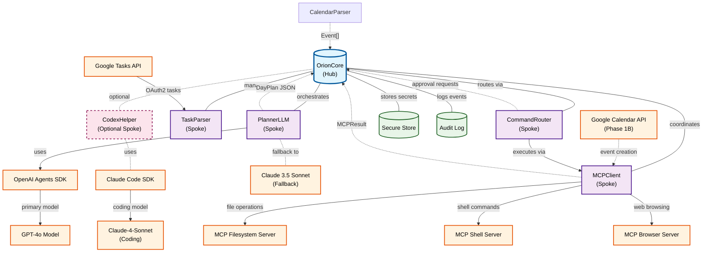

# Orion - Component Architecture Diagram

## Hub-and-Spokes Architecture

This diagram illustrates the core architectural pattern of the Orion task planning copilot, showing how OrionCore acts as the central hub orchestrating various specialized components (spokes) for conversational task interviewing and scheduling.

## Component Descriptions

### Hub

- **OrionCore**: Central orchestration component managing conversation loops, tool coordination, memory, approvals, and audit logging

### Core Spokes

- **PlannerLLM**: Conducts conversational task interviews and generates structured task plans (TaskPlan JSON) with scheduling recommendations
- **TaskParser**: Reads and normalizes tasks from Google Tasks API into unified Task[] format
- **MCPClient**: Gateway to local capabilities via Model Context Protocol servers (file system, shell access)
- **CommandRouter**: Classifies LLM intents, performs risk scoring, and routes commands to appropriate MCP tools with approval gates

### Optional Components

- **CodexHelper**: Provides code generation, refactoring, and sandboxed execution capabilities

### Supporting Infrastructure

- **Secure Store**: Manages API keys, tokens, per-tool scopes, and cryptographic salts using OS keychain integration
- **AuditLog**: Append-only event journal (JSONL) with cryptographic hash chaining for security and compliance

### External Integrations

- **Task APIs**: Google Tasks API v1 for reading task lists and items
- **Calendar APIs**: Google Calendar API v3 for event creation (Phase 1B via MCP)
- **AI Models**: Primary GPT-4o via OpenAI Agents SDK with Claude 3.5 Sonnet as planning fallback, and Claude-4-Sonnet via Claude Code SDK for advanced coding capabilities
- **MCP Servers**: Built-in filesystem, shell, and web browsing servers for local system access

## Data Flow

1. **Ingest**: Google Tasks API → TaskParser → OrionCore context
2. **Interview**: User request → PlannerLLM (conversational task prioritization) → OrionCore
3. **Clarify**: Multi-turn loop for task context and priority exploration
4. **Analyze**: PlannerLLM generates TaskPlan with scheduling recommendations
5. **Act**: CommandRouter → MCPClient tools (filesystem/shell operations for task context)
6. **Schedule** (Phase 1B): Create calendar events via MCPClient → CommandRouter approvals
7. **Persist**: Store task analysis, preferences, and conversation history

## Architecture Benefits

- **Separation of Concerns**: Each spoke handles a specific domain (tasks, conversational planning, execution)
- **Extensibility**: New spokes can be added without modifying the hub
- **Security**: Centralized approval and audit logging through the hub
- **Testability**: Individual spokes can be tested in isolation
- **Scalability**: Hub can manage resource allocation and load balancing across spokes
