# Orion - Component Architecture Diagram

## Hub-and-Spokes Architecture

This diagram illustrates the core architectural pattern of the Orion daily planning copilot, showing how OrionCore acts as the central hub orchestrating various specialized components (spokes).

```mermaid
graph TB
    %% Hub-and-Spokes Architecture for Orion

    %% Central Hub
    OrionCore[("OrionCore<br/>(Hub)")]

    %% Core Spokes
    PlannerLLM["PlannerLLM<br/>(Spoke)"]
    CalendarParser["CalendarParser<br/>(Spoke)"]
    MCPClient["MCPClient<br/>(Spoke)"]
    CommandRouter["CommandRouter<br/>(Spoke)"]
    CodexHelper["CodexHelper<br/>(Optional Spoke)"]

    %% Supporting Components
    SecureStore[("Secure Store")]
    AuditLog[("Audit Log")]

    %% External Calendar Sources
    GoogleCal["Google Calendar API"]
    MSGraph["Microsoft Graph API"]
    ICSFiles["Local .ics Files"]

    %% MCP Servers
    MCPFileSystem["MCP Filesystem Server"]
    MCPShell["MCP Shell Server"]
    MCPBrowser["MCP Browser Server"]

        %% External AI Services
    OpenAISDK["OpenAI Agents SDK"]
    GPT4o["GPT-4o Model"]
    Claude35["Claude 3.5 Sonnet<br/>(Fallback)"]
    ClaudeCodeSDK["Claude Code SDK"]
    Claude4["Claude-4-Sonnet<br/>(Coding)"]

    %% Hub to Spokes Connections
    OrionCore ---|"orchestrates"| PlannerLLM
    OrionCore ---|"manages"| CalendarParser
    OrionCore ---|"coordinates"| MCPClient
    OrionCore ---|"routes via"| CommandRouter
    OrionCore -.-|"optional"| CodexHelper

    %% Supporting Infrastructure
    OrionCore ---|"stores secrets"| SecureStore
    OrionCore ---|"logs events"| AuditLog

    %% Calendar Sources to Parser
    GoogleCal -->|"OAuth2 events"| CalendarParser
    MSGraph -->|"Graph API events"| CalendarParser
    ICSFiles -->|"RFC 5545 files"| CalendarParser

    %% MCP Connections
    MCPClient -->|"file operations"| MCPFileSystem
    MCPClient -->|"shell commands"| MCPShell
    MCPClient -->|"web browsing"| MCPBrowser

    %% CommandRouter to MCP
    CommandRouter -->|"executes via"| MCPClient

    %% AI Model Connections
    PlannerLLM -->|"uses"| OpenAISDK
    PlannerLLM -.-|"fallback to"| Claude35
    OpenAISDK -->|"primary model"| GPT4o
    CodexHelper -.-|"uses"| ClaudeCodeSDK
    ClaudeCodeSDK -->|"coding model"| Claude4

    %% Data Flow Annotations
    CalendarParser -.->|"Event[]"| OrionCore
    PlannerLLM -.->|"DayPlan JSON"| OrionCore
    MCPClient -.->|"MCPResult"| OrionCore
    CommandRouter -.->|"approval requests"| OrionCore

    %% Styling
    classDef hubStyle fill:#e1f5fe,stroke:#01579b,stroke-width:3px,color:#000
    classDef spokeStyle fill:#f3e5f5,stroke:#4a148c,stroke-width:2px,color:#000
    classDef externalStyle fill:#fff3e0,stroke:#e65100,stroke-width:2px,color:#000
    classDef storageStyle fill:#e8f5e8,stroke:#1b5e20,stroke-width:2px,color:#000
    classDef optionalStyle fill:#fce4ec,stroke:#880e4f,stroke-width:2px,stroke-dasharray: 5 5,color:#000

    class OrionCore hubStyle
    class PlannerLLM,CalendarParser,MCPClient,CommandRouter spokeStyle
    class CodexHelper optionalStyle
    class GoogleCal,MSGraph,ICSFiles,MCPFileSystem,MCPShell,MCPBrowser,OpenAISDK,GPT4o,Claude35,ClaudeCodeSDK,Claude4 externalStyle
    class SecureStore,AuditLog storageStyle
```

## Component Descriptions

### Hub

- **OrionCore**: Central orchestration component managing conversation loops, tool coordination, memory, approvals, and audit logging

### Core Spokes

- **PlannerLLM**: Generates structured day plans (DayPlan JSON) from calendar context and user preferences
- **CalendarParser**: Normalizes events from Google Calendar, Microsoft Graph, and local .ics files into unified Event[] format
- **MCPClient**: Gateway to local capabilities via Model Context Protocol servers (file system, shell access)
- **CommandRouter**: Classifies LLM intents, performs risk scoring, and routes commands to appropriate MCP tools with approval gates

### Optional Components

- **CodexHelper**: Provides code generation, refactoring, and sandboxed execution capabilities

### Supporting Infrastructure

- **Secure Store**: Manages API keys, tokens, per-tool scopes, and cryptographic salts using OS keychain integration
- **AuditLog**: Append-only event journal (JSONL) with cryptographic hash chaining for security and compliance

### External Integrations

- **Calendar APIs**: Google Calendar API v3, Microsoft Graph Calendar API, and local iCalendar (.ics) file support
- **AI Models**: Primary GPT-4o via OpenAI Agents SDK with Claude 3.5 Sonnet as planning fallback, and Claude-4-Sonnet via Claude Code SDK for advanced coding capabilities
- **MCP Servers**: Built-in filesystem, shell, and web browsing servers for local system access

## Data Flow

1. **Ingest**: Calendar sources → CalendarParser → OrionCore context
2. **Plan**: User request → PlannerLLM (JSON structured output) → OrionCore
3. **Clarify**: Multi-turn loop for ambiguous events
4. **Act**: CommandRouter → MCPClient tools (filesystem/shell operations)
5. **Write-back**: Optional calendar event creation/modification via provider APIs
6. **Persist**: Store preferences, scopes, and audit logs

## Architecture Benefits

- **Separation of Concerns**: Each spoke handles a specific domain (calendars, planning, execution)
- **Extensibility**: New spokes can be added without modifying the hub
- **Security**: Centralized approval and audit logging through the hub
- **Testability**: Individual spokes can be tested in isolation
- **Scalability**: Hub can manage resource allocation and load balancing across spokes
