# Orion - Package Architecture Diagram

## Modular Package Structure

This diagram illustrates the modular package architecture of the Orion daily planning copilot, showing package dependencies, interfaces, and data flow between components.

```mermaid
graph TB
    %% Core Packages
    subgraph "Core Packages"
        OrionCore["@orion/core<br/>• Conversation loop<br/>• Tool orchestration<br/>• Memory management<br/>• Approval workflows"]
        CLI["@orion/cli<br/>• Command line interface<br/>• User interaction<br/>• Configuration loading"]
    end

    %% Domain Packages
    subgraph "Domain Packages"
        PlannerLLM["@orion/planner-llm<br/>• DayPlan generation<br/>• Structured outputs<br/>• OpenAI Agents SDK"]
        CalendarParser["@orion/calendar-parser<br/>• Multi-provider events<br/>• Timezone handling<br/>• Recurrence expansion"]
        MCPClient["@orion/mcp-client<br/>• MCP protocol bridge<br/>• Tool execution<br/>• Scope enforcement"]
        CommandRouter["@orion/command-router<br/>• Intent classification<br/>• Risk scoring<br/>• Approval gating"]
        CodexHelper["@orion/codex-helper<br/>• Code generation<br/>• Sandboxed execution<br/>• Development workflows"]
    end

    %% Infrastructure Packages
    subgraph "Infrastructure Packages"
        SecureStore["@orion/secure-store<br/>• Keychain integration<br/>• Secret management<br/>• Token rotation"]
        AuditLog["@orion/audit-log<br/>• Event journaling<br/>• Cryptographic hashing<br/>• JSONL format"]
        Config["@orion/config<br/>• Schema validation<br/>• Environment handling<br/>• Type definitions"]
    end

    %% External Dependencies
    subgraph "External Dependencies"
        OpenAISDK["@openai/agents<br/>• Agent framework<br/>• Structured outputs<br/>• Tool definitions"]
        MCPProtocol["@modelcontextprotocol/sdk<br/>• MCP specification<br/>• Server communication<br/>• Protocol handling"]
        GoogleAPI["googleapis<br/>• Google Calendar API<br/>• OAuth2 integration<br/>• Event CRUD"]
        MSGraphAPI["@azure/msal-node<br/>• Microsoft Graph API<br/>• Azure AD auth<br/>• Calendar access"]
        NodeKeytar["node-keytar<br/>• OS keychain access<br/>• Cross-platform secrets<br/>• Secure storage"]
    end

    %% MCP Servers (External)
    subgraph "MCP Servers"
        MCPFileSystem["MCP Filesystem Server<br/>• File operations<br/>• Directory traversal<br/>• Content reading"]
        MCPShell["MCP Shell Server<br/>• Command execution<br/>• Process management<br/>• Output capture"]
        MCPBrowser["MCP Browser Server<br/>• Web browsing<br/>• Content extraction<br/>• URL handling"]
    end

    %% Core Dependencies
    CLI --> OrionCore
    OrionCore --> Config
    OrionCore --> SecureStore
    OrionCore --> AuditLog

    %% Domain Package Dependencies
    OrionCore --> PlannerLLM
    OrionCore --> CalendarParser
    OrionCore --> MCPClient
    OrionCore --> CommandRouter
    OrionCore -.->|"optional"| CodexHelper

    %% Cross-Domain Dependencies
    CommandRouter --> MCPClient
    PlannerLLM --> Config
    CalendarParser --> Config
    MCPClient --> Config

    %% External API Dependencies
    PlannerLLM --> OpenAISDK
    CalendarParser --> GoogleAPI
    CalendarParser --> MSGraphAPI
    SecureStore --> NodeKeytar
    MCPClient --> MCPProtocol

    %% MCP Server Connections
    MCPClient --> MCPFileSystem
    MCPClient --> MCPShell
    MCPClient --> MCPBrowser

    %% Data Flow Annotations
    CalendarParser -.->|"Event[]"| OrionCore
    PlannerLLM -.->|"DayPlan JSON"| OrionCore
    MCPClient -.->|"MCPResult"| OrionCore
    CommandRouter -.->|"ApprovalRequest"| OrionCore
    SecureStore -.->|"Credentials"| CalendarParser
    SecureStore -.->|"API Keys"| PlannerLLM
    AuditLog -.->|"Event Stream"| OrionCore

    %% Styling
    classDef coreStyle fill:#e1f5fe,stroke:#01579b,stroke-width:3px,color:#000
    classDef domainStyle fill:#f3e5f5,stroke:#4a148c,stroke-width:2px,color:#000
    classDef infraStyle fill:#e8f5e8,stroke:#1b5e20,stroke-width:2px,color:#000
    classDef externalStyle fill:#fff3e0,stroke:#e65100,stroke-width:2px,color:#000
    classDef mcpStyle fill:#fce4ec,stroke:#880e4f,stroke-width:2px,color:#000
    classDef optionalStyle stroke-dasharray: 5 5

    class OrionCore,CLI coreStyle
    class PlannerLLM,CalendarParser,MCPClient,CommandRouter,CodexHelper domainStyle
    class SecureStore,AuditLog,Config infraStyle
    class OpenAISDK,MCPProtocol,GoogleAPI,MSGraphAPI,NodeKeytar externalStyle
    class MCPFileSystem,MCPShell,MCPBrowser mcpStyle
    class CodexHelper optionalStyle
```



## Package Descriptions

### Core Packages

**@orion/core**

- Central orchestration and conversation management
- Tool coordination and approval workflows
- Memory management and context assembly
- State machine for planning lifecycle

**@orion/cli**

- Command-line interface and user interaction
- Configuration loading and validation
- Session management and output formatting

### Domain Packages

**@orion/planner-llm**

- Generates structured DayPlan JSON from calendar context
- Integrates with OpenAI Agents SDK for structured outputs
- Handles multi-turn clarification loops
- Model aliasing and fallback strategies

**@orion/calendar-parser**

- Unifies calendar inputs from multiple providers
- Handles timezone canonicalization and recurrence expansion
- Supports Google Calendar, Microsoft Graph, and .ics files
- Privacy-aware event masking

**@orion/mcp-client**

- Bridges to Model Context Protocol servers
- Enforces security scopes and resource limits
- Provides unified interface for file and shell operations
- Handles connection management and error recovery

**@orion/command-router**

- Classifies LLM intents into actionable commands
- Performs risk scoring and policy enforcement
- Manages approval workflows and dry-run previews
- Routes commands to appropriate MCP tools

**@orion/codex-helper** (Optional)

- Code generation and refactoring capabilities
- Sandboxed execution environment
- Repository context chunking and indexing
- Development workflow automation

### Infrastructure Packages

**@orion/secure-store**

- OS keychain integration for secure credential storage
- API key and token management with rotation
- Per-tool scope enforcement and access control
- Cross-platform secret handling

**@orion/audit-log**

- Append-only event journaling in JSONL format
- Cryptographic hash chaining for integrity
- Structured logging with redaction middleware
- Compliance and security audit trail

**@orion/config**

- Configuration schema validation and type definitions
- Environment-based configuration management
- Phase-specific feature flags and settings
- Backwards compatibility and migration support

## Package Dependencies

### Dependency Layers

1. **External Layer**: Third-party APIs and services
2. **Infrastructure Layer**: Cross-cutting concerns (config, security, logging)
3. **Domain Layer**: Business logic and specialized capabilities
4. **Core Layer**: Orchestration and user interface

### Key Interfaces

```typescript
// Inter-package interfaces
interface Event {
	id: string;
	provider: 'google' | 'msgraph' | 'ics';
	title: string;
	start: string; // ISO 8601
	end: string;
	// ... additional fields
}

interface DayPlan {
	date: string; // YYYY-MM-DD
	summary: string;
	blocks: PlanBlock[];
	ambiguities?: Ambiguity[];
	suggestions?: string[];
}

interface MCPResult {
	ok: boolean;
	stdout?: string;
	stderr?: string;
	data?: unknown;
}

interface ApprovalRequest {
	kind: 'approval-request';
	risk: 'low' | 'medium' | 'high';
	preview: CommandPreview;
	expiresAt: string;
}
```

## Build and Deployment

### Monorepo Structure

```
/orion
  /packages
    /core              # @orion/core
    /cli               # @orion/cli
    /planner-llm       # @orion/planner-llm
    /calendar-parser   # @orion/calendar-parser
    /mcp-client        # @orion/mcp-client
    /command-router    # @orion/command-router
    /codex-helper      # @orion/codex-helper
    /secure-store      # @orion/secure-store
    /audit-log         # @orion/audit-log
    /config            # @orion/config
  /shared
    /types             # Shared TypeScript definitions
    /utils             # Common utilities
  /fixtures            # Test data and mocks
  /scripts             # Build and development scripts
```

### Package Publishing Strategy

- **Internal packages**: Scoped `@orion/*` for core functionality
- **Dependency management**: Workspace-based with locked versions
- **Version synchronization**: Semantic versioning with coordinated releases
- **Distribution**: npm registry with enterprise support

## Architecture Benefits

- **Modularity**: Clean separation of concerns with well-defined interfaces
- **Testability**: Individual packages can be unit tested in isolation
- **Extensibility**: New packages can be added without core changes
- **Maintainability**: Domain-specific packages reduce cognitive load
- **Reusability**: Infrastructure packages can be shared across projects
- **Security**: Centralized credential management with scoped access
