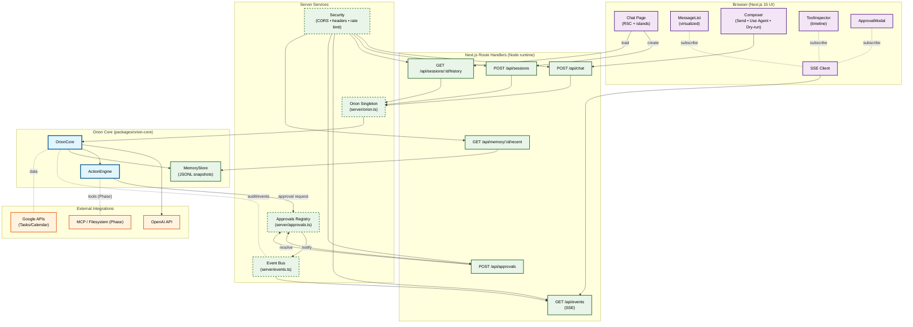

# Orion - Web App Component Diagram

## Next.js 15 Chat UI Architecture

This diagram illustrates the web application architecture for the Orion chat interface, showing the browser UI, Next.js route handlers, server services, the Orion core, and external integrations.

## Component Descriptions

### Browser (Next.js 15 UI)

- Chat page composed with RSC and island hydration
- Composer with toggles for Use Agent, Dry‑run, Auto‑approve low
- Streaming updates via SSE; inspector and modals subscribe to events

### Next.js Route Handlers

- Node runtime handlers for chat, sessions, history, events (SSE), approvals, and memory
- Validate inputs, enforce CORS and rate limits, and set secure headers

### Server Services

- `server/orion.ts`: Orion singleton and configuration bootstrap
- `server/events.ts`: pub/sub for event fan‑out to SSE clients
- `server/approvals.ts`: pending approval registry and resolution
- `server/security.ts`: CORS, headers, and rate limiting

### Orion Core

- `OrionCore` orchestrates conversation, tools, approvals, and memory
- `ActionEngine` manages tool execution with risk and approvals
- `MemoryStore` provides short‑term memory and JSONL snapshots

### External Integrations

- OpenAI API for chat/planning
- MCP (future) for local capabilities
- Google APIs for tasks/calendar
